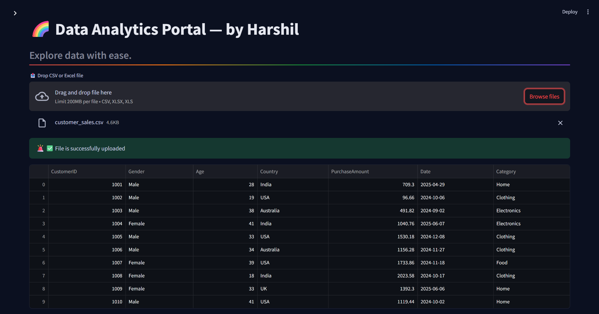
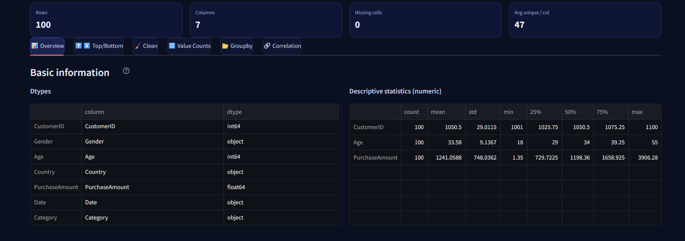
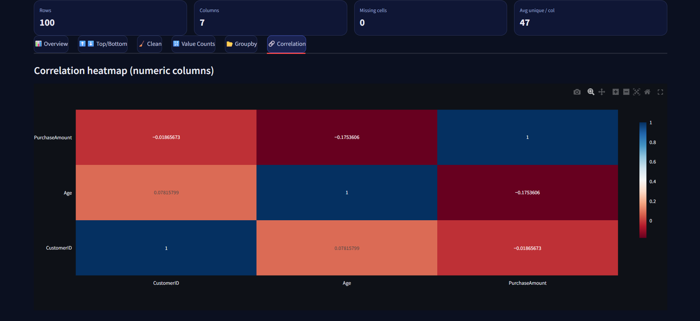

# 📊 Data Analytics Portal - Project

An interactive **Streamlit web application** to perform **data analysis and visualization** with ease. This project is designed for **Data Analysts** and **Data Science enthusiasts** to showcase core skills such as **data cleaning**, **exploration**, and **visualization** in a user-friendly web interface.

---

## 🌟 Features

✅ **Upload Your Data** – Upload CSV files and start analyzing instantly  
✅ **Overview** – Get quick insights: shape, columns, data types, and summary statistics  
✅ **Top / Bottom Rows** – Preview your dataset  
✅ **Data Cleaning** – Remove null values & duplicates with one click  
✅ **Value Counts** – Analyze categorical columns easily  
✅ **Groupby Analysis** – Aggregate data for meaningful insights  
✅ **Correlation Heatmap** – Understand relationships between numerical features  
✅ **Visualizations** – Beautiful charts using Matplotlib & Seaborn  

---

## 🛠 Tech Stack

- **Python** (Pandas, Numpy)
- **Streamlit** (Frontend + Backend)
- **Seaborn & Matplotlib** (Data Visualization)

---

## 📸 Screenshots

### 1️⃣ **Home Page**


### 2️⃣ **Overview**


### 3️⃣ **Correlation Heatmap**


---

### 🌍 Live Demo
```bash

```
---

### ✨ How It Works

- Upload a CSV file

- Explore dataset overview and summary stats

- Clean data (drop nulls & duplicates)

- Visualize value counts, groupby results, and correlations

- Gain insights through interactive charts

---

### 🧑‍💻 Author

**👤 Harshil Darji**
**📧 Email: harshilsunildarji@gmail.com**

--- 

## 🔗 Connect With Me
[](https://www.linkedin.com/in/harshil-darji-6b3a54353)
